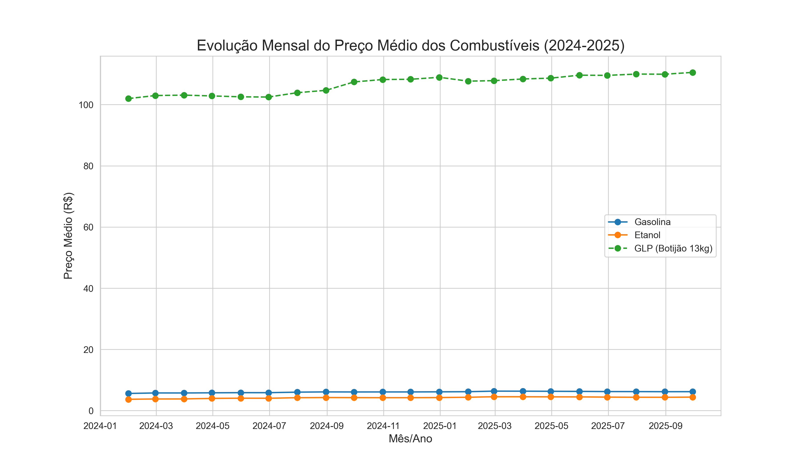
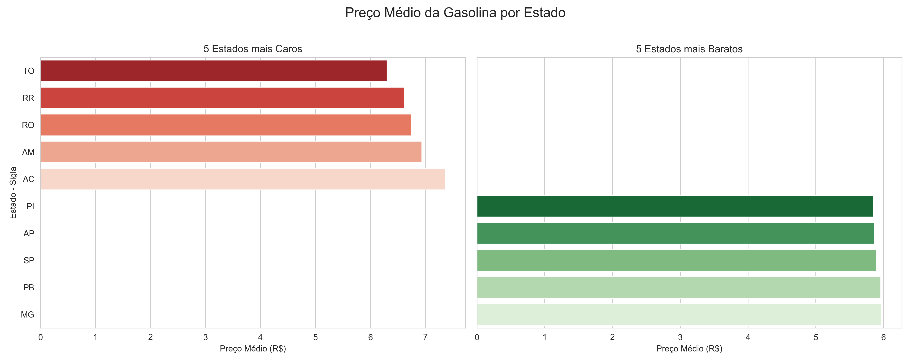
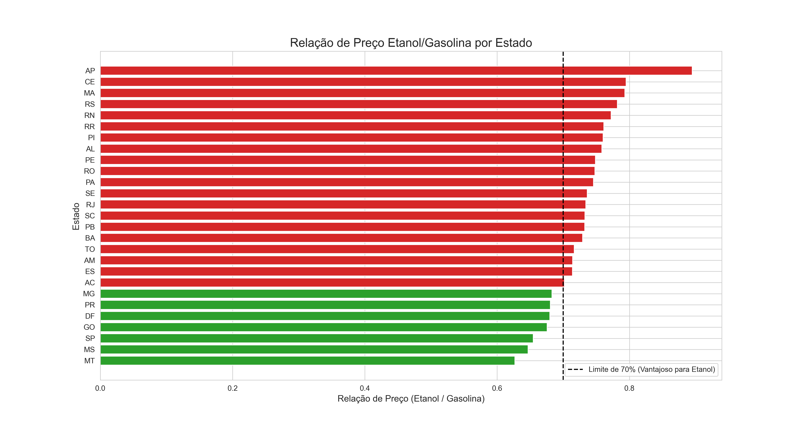

# Análise de Preços de Combustíveis no Brasil (GLP, Gasolina e Etanol)

Este projeto realiza a coleta, o processamento e a visualização de dados abertos sobre os preços de combustíveis no Brasil, disponibilizados pela Agência Nacional do Petróleo, Gás Natural e Biocombustíveis (ANP).

O objetivo é analisar as tendências de preços do Gás Liquefeito de Petróleo (GLP), da Gasolina comum e do Etanol hidratado, comparando suas variações ao longo do tempo e entre os diferentes estados do país.

**Fonte dos Dados:** [Dados Abertos da ANP](https://www.gov.br/anp/pt-br/centrais-de-conteudo/dados-abertos/serie-historica-de-precos-de-combustiveis)

---

## Como Executar o Projeto

Para executar a análise, siga os passos abaixo:

**1. Pré-requisitos:**
* Python 3.7 ou superior
* PIP (gerenciador de pacotes do Python)

**2. Clone este repositório:**
```bash
git clone <URL-DO-SEU-REPOSITORIO>
cd <NOME-DO-SEU-REPOSITORIO>
```

**3. Instale as dependências:**
O projeto utiliza as bibliotecas `pandas`, `matplotlib`, `seaborn` e `requests`. Instale-as com o seguinte comando:
```bash
pip install pandas matplotlib seaborn requests
```

**4. Execute o script principal:**
O script irá criar as pastas, baixar os dados, processá-los e salvar os gráficos na pasta `graficos/`.
```bash
python analise_combustiveis.py
```

---

## Análises e Gráficos Gerados

### 1. Evolução Mensal do Preço Médio dos Combustíveis

Este gráfico mostra a variação do preço médio de venda da Gasolina, do Etanol e do GLP (botijão de 13kg) entre 2024 e 2025. Ele permite identificar tendências de alta ou baixa, sazonalidades e o comportamento dos preços ao longo do tempo.



**Análise:** Através da linha do tempo, é possível comparar a volatilidade de cada combustível. Observa-se a diferença de patamar entre os preços, com o GLP sendo vendido em uma unidade diferente (R$ por 13kg) em comparação com a gasolina e o etanol (R$ por litro).

### 2. Comparativo de Preços da Gasolina por Estado

Para entender as disparidades regionais, este gráfico destaca os 5 estados onde a gasolina apresentou o maior preço médio e os 5 estados com o menor preço médio no período analisado.



**Análise:** Fica evidente a grande variação de preços dentro do Brasil. Fatores como logística, impostos estaduais (ICMS) e a estrutura de distribuição local influenciam diretamente nesses valores.

### 3. Relação de Preço Etanol vs. Gasolina

É culturalmente aceito que abastecer com Etanol é financeiramente vantajoso quando seu preço por litro é igual ou inferior a 70% do preço do litro da Gasolina. Este gráfico mostra essa relação para cada estado.

* **Barras Verdes:** Estados onde o preço do etanol é vantajoso (relação <= 0.7).
* **Barras Vermelhas:** Estados onde a gasolina é mais vantajosa (relação > 0.7).



**Análise:** O gráfico serve como um guia rápido para o consumidor. Vemos que a vantagem do etanol é mais comum em estados produtores, como os do Centro-Sul, enquanto em outras regiões a gasolina quase sempre compensa mais.
